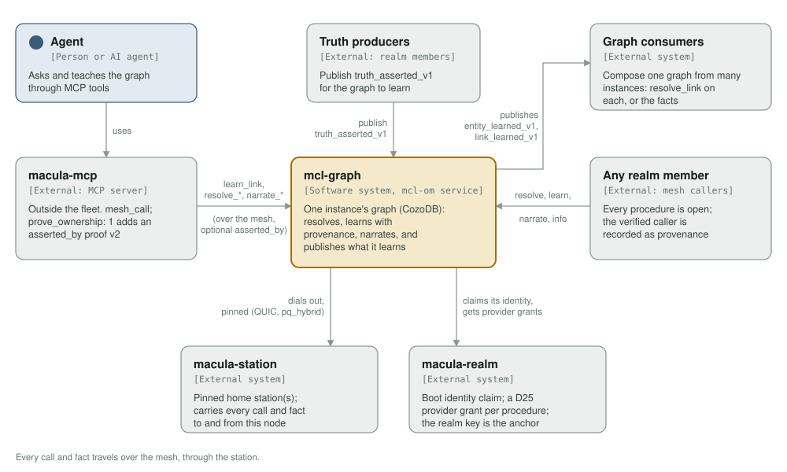
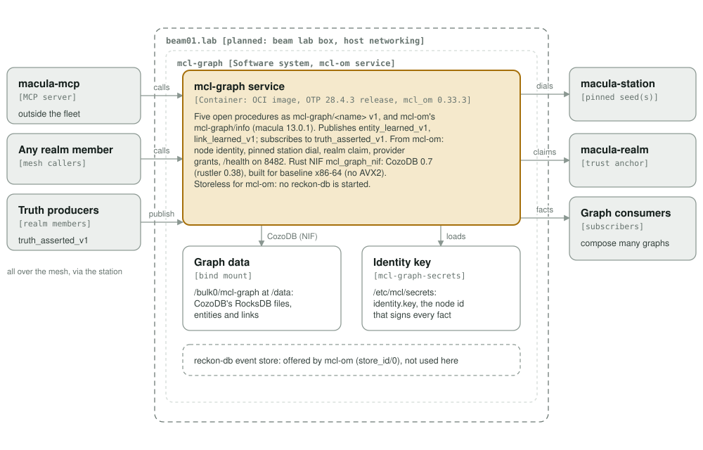
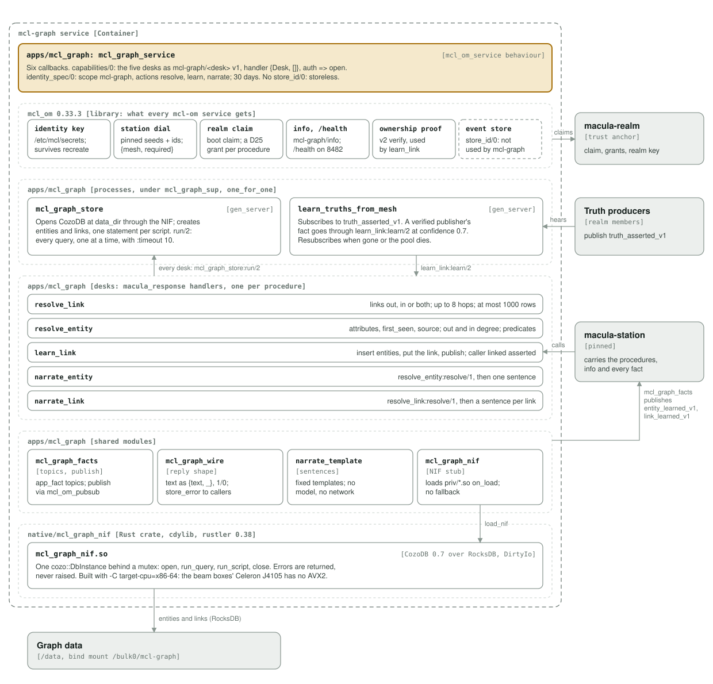

# mcl-graph architecture: C4 model

*This exists so any member of the realm can ask what is related to what, and teach it a new relationship, in one call, with the teller recorded beside what it told.*

**Status: 2026-09-29, drawn from the 0.2.0 source** (mcl_om 0.33.3, macula 13.0.1, CozoDB 0.7 through rustler 0.38). Everything here describes code that exists. Two things are drawn dashed: mcl-om's event store wiring, which mcl-graph does not take up, and the placement on beam01, which is planned and not yet in macula-fleet.

`mcl-graph` is an embeddable relational-graph database as a mesh service. Each instance keeps its own [CozoDB](https://github.com/cozodb/cozo) graph (Datalog over RocksDB) on local disk, answers link and entity lookups over it, learns new links from callers and from `truth_asserted` facts, and publishes what it learns. It is an `mcl-om` service: one OTP release in one OCI container, with its node identity, pinned outbound station dial, realm identity claim, provider grants, `mcl-graph/info` and `/health` coming from [`mcl-om`](https://github.com/macula-services/mcl-om).

Legend used in all three diagrams: the amber box is the element in scope, blue boxes are people, grey boxes are external, and dashed boxes are not used by this deployment (mcl-om's event store). Dashed boundaries are deployment and grouping boundaries; the beam01 one is planned.

## Level 1: system context

| Element | Role |
| --- | --- |
| mcl-graph | One instance's relational graph: resolves links and entities, learns links with their provenance, narrates, and publishes what it learns |
| Agent | A person or an AI agent working through `macula-mcp`'s tools |
| macula-mcp | MCP server outside the fleet. Its generic `mesh_call` tool reaches `mcl-graph/<procedure>`; with `prove_ownership: 1` it attaches an ownership proof v2 under `asserted_by`, which `learn_link` verifies. There is no graph-specific tool |
| Any realm member | Every procedure is `auth => open`: any caller the realm admits may read and add. There is no operator list and no quota. The caller macula verified on the wire is recorded as provenance |
| Truth producers | Any realm member publishing `truth_asserted_v1` for the graph to learn. A shared, opt-in contract under the graph's org, not a translation of other services' events |
| Graph consumers | Whoever composes one knowledge graph from many instances: by calling `resolve_link` on each (pull), or by subscribing to `entity_learned_v1` and `link_learned_v1` (push) |
| macula-station | The pinned home station(s) the service dials out to over QUIC with the `pq_hybrid` profile; every call and fact to and from this node goes through them |
| macula-realm | Takes the boot identity claim (labelled with `MCL_SERVICE_NAME` and `MCL_BOX`) and grants a D25 provider authorization per procedure; its public key (`MCL_REALM_KEY`) is the trust anchor for every advertisement |

**The graph is per instance.** Instances never talk to each other and nothing replicates between them. One knowledge graph across the mesh is something a consumer builds, by pull or by push. Facts are published with `mode => async_log`: a fact published while the mesh is dark is dropped, not queued, so a consumer that must not miss anything also pulls.

**Open, with provenance instead of a gate.** Anyone in the realm may add links. What stops the graph being anonymous is that `learn_link` links the caller (hex node id) `asserted` to both endpoints at confidence 1.0, so "what has X told the graph" is an ordinary `resolve_link` with subject X and predicate `asserted`. A relay can name who it acts for in `asserted_by`; a claim that is present and fails is refused with its reason and nothing is learned, never quietly recorded under the relay.

## Level 2: containers

| Container | Technology | Responsibility |
| --- | --- | --- |
| mcl-graph service | OCI image (`ghcr.io/macula-services/mcl-graph`, deployed by digest), OTP 28.4.3 release `mcl_graph`, `mcl_om_service` behaviour, the Rust NIF `mcl_graph_nif` (CozoDB 0.7, rustler 0.38) in `priv/` | Five procedures as `mcl-graph/<name>` v1 plus mcl-om's `mcl-graph/info`; publishes `entity_learned_v1` and `link_learned_v1`; subscribes to `truth_asserted_v1`. Health on 8482, host networking |
| Graph data | Bind mount `${MCL_GRAPH_DATA:-/bulk0/mcl-graph}` at `/data` (`MCL_DATA_DIR`) | CozoDB's RocksDB directory: the `entities` and `links` relations. Without the mount every recreate forgets the graph |
| Identity key | Named volume `mcl-graph-secrets` at `/etc/mcl/secrets` | The node key mcl-om keeps at `identity.key`; the node id, which signs every fact and advertisement, survives a container recreate |

**Build.** The image is built in the fleet's rocksdb image pair, `macula-ci-otp-rocksdb` (builder) and `macula-pq-runtime-rocksdb` (runtime), both pinned by dated tag and digest. The builder asserts OTP 28.4.3 with ML-DSA before building, and the release step fails unless `priv/mcl_graph_nif.so` is in the release. cozorocks compiles its own vendored RocksDB, lz4 and zstd into the NIF; the image's librocksdb is not used.

**The NIF is built for the baseline x86-64 CPU.** `native/build-nif.sh` sets `RUSTFLAGS="-C target-cpu=x86-64"` on x86_64, never the build machine's CPU. cozorocks turns on `-mavx2` whenever Rust's target features include it, and the beam boxes are Celeron J4105s without AVX2: a NIF built for the build host loads there and dies with SIGILL on the first RocksDB call. There is no pure-Erlang fallback; a failed NIF build fails the compile.

**Placement (planned).** beam01, a beam lab box, running the image by digest pinned in macula-fleet and reconciled from there, with `/bulk0/mcl-graph` on its bulk drive. Host networking because stations are reachable over IPv6 and a default bridge has none. The service's own compose file (`deploy/docker-compose.yml`) carries what the service knows about itself; which box, station, realm and digest belong to macula-fleet.

**What mcl-om gives it, and what it leaves.** From mcl-om: the node key on the identity volume, the pinned station dial (`MACULA_STATION_SEEDS` paired index for index with `MACULA_STATION_NODE_IDS`; with `{mesh, required}` a boot missing the realm, its key or the pinned stations stops and names each one), the boot identity claim, capability adverts gated on the realm's grants, `mcl-graph/info`, `/health`, publishing (`mcl_om_pubsub`), the mesh handles the subscriber uses (`mcl_om:mesh_handles/0`) and the ownership proof check (`mcl_om_ownership_proof`). mcl-om would also start a reckon-db event store for a service that exports `store_id/0`; `mcl_graph_service` does not, so no event store runs. The graph's state is CozoDB, opened by this repo's own NIF.

## Level 3: components of the service

| Component | Kind | Responsibility |
| --- | --- | --- |
| `mcl_graph_app` | OTP application | `start/2` is `mcl_om:boot(mcl_graph_service)` |
| `mcl_graph_service` | `mcl_om_service` module | Six callbacks. `capabilities/0` lists the five desks, each `#{version => 1, handler => {Desk, []}, auth => open}`. `identity_spec/0` asks for scope `mcl-graph`, actions `resolve`, `learn`, `narrate`, resources `entity_learned`, `link_learned`, 30 days. `health/0` is `{down, store_not_open}`, `{degraded, not_hearing_truths}` or `ok`. `start/1` refuses a realm name whose sha256 is not `MCL_REALM`, then starts `mcl_graph_sup` |
| `mcl_graph_sup` | Supervisor, `one_for_one` | Two permanent workers: `mcl_graph_store`, then `learn_truths_from_mesh` |
| `mcl_graph_store` | gen_server | Opens CozoDB at `data_dir` through the NIF and holds its resource. Creates `entities` and `links` one statement per script (an existing relation is the expected no-op). `run/2` serves every query, appending CozoDB's `:timeout 10`; a CozoDB failure comes back as `{cozo, Text}` with its colour codes removed |
| `learn_truths_from_mesh` | gen_server, subscriber | Subscribes to `truth_asserted_v1`. A fact whose publisher macula verified goes through `learn_link:learn/2` with that publisher as the caller, at confidence 0.7; an unverified one or a non-map is refused and logged. Resubscribes on `macula_event_gone` or when the pool dies, retries every 5 s while the mesh is dark. `/health` reads whether it holds the subscription |
| `resolve_link` | Desk, `macula_response` | Links of a subject: `direction` `out` (default), `in` or `both`, optional `predicate`, `depth` 1 to 8 (above 1, each reachable entity at its fewest hops). At most 1000 rows, as maps named by CozoDB's headers |
| `resolve_entity` | Desk, `macula_response` | `id`, `attributes`, `first_seen`, `source`, then `out_degree`, `in_degree` and the distinct `predicates`. A failed count fails the call rather than reading as "no links" |
| `learn_link` | Desk, `macula_response` | Ensures subject and object (`:insert`, so exactly one racing call publishes `entity_learned`), `:put`s the link (`link_id` = first 16 hex of sha256 of subject, predicate, object and time), publishes `link_learned`, then links the caller `asserted` to both ends. The caller is the wire caller, or the identity of a verified `asserted_by` bound to `mcl-graph/learn_link` |
| `narrate_entity`, `narrate_link` | Desks, `macula_response` | Call `resolve_entity:resolve/1` or `resolve_link:resolve/1` as plain functions (no mesh round trip) and render through `narrate_template` |
| `narrate_template` | Module | One fixed sentence per entity or link. No model and no network call |
| `mcl_graph_facts` | Module | Topics through `macula_topic:app_fact/6`: org `mcl-graph`, app `graph`, domain `knowledge`, version 1, e.g. `io.macula/mcl-graph/graph/knowledge/link_learned_v1`. Publishes through `mcl_om_pubsub` with `async_log`. Checks the realm name against the realm tag |
| `mcl_graph_wire` | Module | Every binary leaves as `{text, Bin}`, booleans as 1/0; a CozoDB failure is logged in full and reaches the caller as `store_error` |
| `mcl_graph_nif` (Erlang) | NIF stub module | Loads `priv/mcl_graph_nif.so` in `on_load`; `open/1`, `run_query/3`, `run_script/2`, `close/1`. If it does not load, the first call raises `undef` |
| `mcl_graph_nif` (Rust) | cdylib, `native/mcl_graph_nif` | One `cozo::DbInstance` over RocksDB behind a mutex. Every NIF runs on a dirty IO scheduler; queries go through `run_script_fold_err`, so a query error is returned as `{error, Message}` and never unwinds into the VM |

**No events, and no second copy of the state.** The desks keep the desk-per-capability shape, but nothing is event sourced: each write goes straight into CozoDB, and `entity_learned` and `link_learned` are integration facts for other contexts, published after the write. The graph on `/data` is the only state.

**One store process.** Every query from every desk and from the subscriber is a `gen_server:call` into `mcl_graph_store`, so the store answers one query at a time. CozoDB's own 10 s timeout, not the 30 s call timeout, is what can stop a query inside the NIF, which is why every query carries it.

**No secondary indexes.** CozoDB 0.7.6's `::index create` returned no rows for a subject that had one, so `links` is keyed `subject, link_id` instead: a lookup by subject is a key-prefix scan, and one by object (`in`, `both`, `in_degree`) scans the relation. The depth cap, the row cap and the timeout bound that scan.

## Open questions

- [ ] macula-fleet `origin/main` (72bca80, 2026-09-29) registers health port 8482 for mcl-graph in `PORTS.md` and carries no mcl-graph deployment yet. Which file will carry the beam01 placement, and which station does it pin?
- [ ] macula-mcp's README and `mesh_call` description say `learn_link` "ignores an invalid" ownership proof. Since the refusal fix it refuses one, with its reason, and learns nothing. That text belongs to macula-mcp: [macula-io/macula-mcp#17](https://github.com/macula-io/macula-mcp/issues/17).

## Editing the diagrams

The SVGs in [`../assets/`](../assets/) are self-contained and all three are generated by [`c4_diagrams.py`](c4_diagrams.py) (run it from the repository root: `python3 architecture/c4_diagrams.py`; standard library only). Colours are plain classes with a `prefers-color-scheme: dark` block, so they render the same on GitHub, in IDE previews and through `rsvg-convert`. CSS custom properties are avoided on purpose: `rsvg-convert` renders them black. Keep this file's tables in step with the diagrams.
